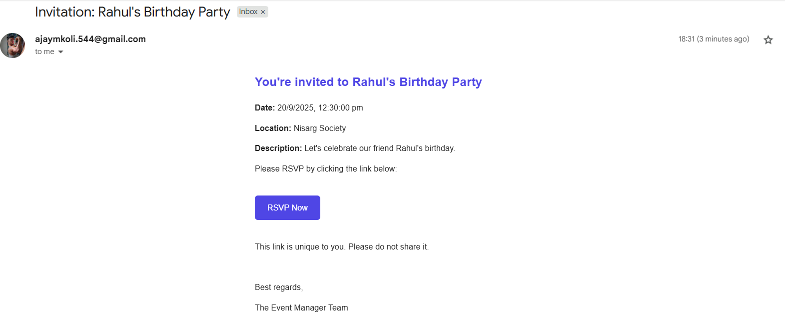
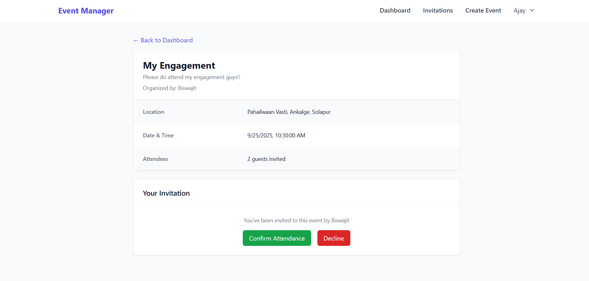
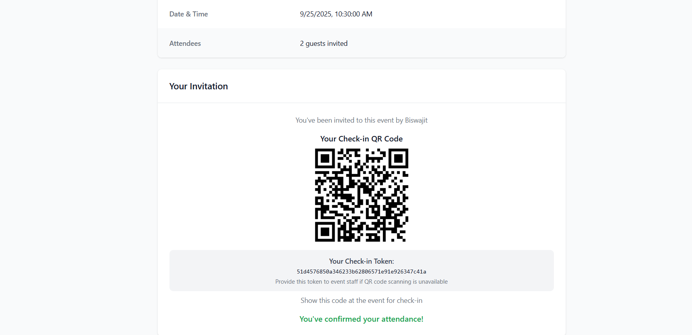

# Event Manager - Full-Stack MERN Event Management & RSVP System


A complete, full-stack event management system built with the MERN stack (MongoDB, Express.js, React, Node.js). This application allows users to create events, send email invitations, manage RSVPs, and check-in attendees using a unique QR code system. It follows the Model-View-Controller (MVC) architectural pattern for a clean and scalable codebase.

## ✨ Features

- **User Authentication & Authorization**: Secure user registration and login using JWT with email verification
- **Role-Based Access Control**: Automatic organizer/attendee role assignment based on event creation
- **Event Management**: Full CRUD operations for events with rich details
- **Email System**: Automated sending of invitations, reminders, and verification emails via Nodemailer
- **QR Code Integration**: 
  - Unique QR codes for event check-in (organizers)
  - Personalized QR codes for attendee check-in
  - Mobile-friendly QR code scanner
- **Dual View Dashboard**: Separate views for events you've created and events you're invited to
- **RSVP Management**: Guests can confirm/decline invitations via email links or event pages
- **Real-time Check-in System**: Instant attendee status updates with visual feedback
- **Responsive Design**: Modern UI built with Tailwind CSS that works on all devices
- **Email Reminders**: Automated reminders sent to confirmed attendees before events

## 🛠️ Technology Stack

### Frontend
- **React 18** with functional components and hooks
- **React Router** for navigation and routing
- **Tailwind CSS** for styling
- **@yudiel/react-qr-scanner** for QR code scanning
- **Axios** for API communication

### Backend
- **Node.js** - Runtime environment
- **Express.js** - Web framework with MVC architecture
- **Mongoose** - MongoDB object modeling
- **JWT** - For authentication
- **Bcryptjs** - For password hashing
- **Nodemailer** - For sending emails
- **QRCode** - For generating QR codes
- **Crypto** - For secure token generation

### Database
- **MongoDB** - NoSQL database with Mongoose ODM

## 📁 Project Structure

```
RVSP/
├── backend/                 # Node.js/Express Backend
│   ├── src/
│   │   ├── config/         # Database configuration
│   │   ├── controllers/    # Route controllers
│   │   ├── middleware/     # Custom middleware
│   │   ├── models/         # Mongoose models
│   │   ├── routes/         # API routes
│   │   ├── utils/          # Utilities and helpers
│   │   ├── views/          # Email templates
│   │   └── server.js       # Express server entry point
│   ├── .env                # Environment variables
│   ├── package.json
│   └── package-lock.json
├── frontend/               # React Frontend
│   ├── public/             # Static assets
│   ├── src/
│   │   ├── api/           # API service functions
│   │   ├── components/    # Reusable components
│   │   ├── context/       # React Context providers
│   │   ├── pages/         # Page components
│   │   └── App.js         # Main application component
│   ├── package.json
│   └── tailwind.config.js
├── OUTPUT/                # Application screenshots
└── README.md
```

## ⚙️ Installation & Setup

### Prerequisites
- Node.js (v16 or higher)
- npm or yarn
- MongoDB database (local or Atlas)
- Gmail account (for email services)

### 1. Clone the Repository
```bash
git clone https://github.com/ajaymkoli/RVSP.git
cd RVSP
```

### 2. Backend Setup
```bash
# Navigate to backend directory
cd backend

# Install dependencies
npm install

# Environment setup
cp .env.example .env
```

Configure your `.env` file:
```ini
PORT=5000
MONGODB_URI=your_mongodb_connection_string
JWT_SECRET=your_jwt_secret_key
EMAIL_USER=your.email@gmail.com
EMAIL_PASS=your_app_specific_password
FRONTEND_URL=http://localhost:3000
```

```bash
# Start development server
npm run dev
```

### 3. Frontend Setup
```bash
# Navigate to frontend directory
cd ../frontend

# Install dependencies
npm install

# Start development server
npm start
```

The application will be available at:
- Frontend: http://localhost:3000
- Backend API: http://localhost:5000

## 🔧 Environment Variables

### Backend (.env)
```ini
PORT=5000
MONGODB_URI=mongodb://localhost:27017/eventmanager
JWT_SECRET=your_super_secret_jwt_key_here
EMAIL_USER=your.email@gmail.com
EMAIL_PASS=your_app_specific_password
FRONTEND_URL=http://localhost:3000
```

*Note: For Gmail, enable 2-factor authentication and generate an "App Password".*

## 🧩 API Endpoints

| Method | Endpoint | Description | Access |
|--------|----------|-------------|--------|
| POST | `/api/auth/register` | Register new user | Public |
| POST | `/api/auth/login` | User login | Public |
| POST | `/api/auth/verify-email` | Verify email address | Public |
| GET | `/api/events` | Get user's events | Private |
| POST | `/api/events` | Create new event | Private |
| GET | `/api/events/:id` | Get event details | Private |
| PUT | `/api/events/:id` | Update event | Private (Creator) |
| DELETE | `/api/events/:id` | Delete event | Private (Creator) |
| POST | `/api/events/:eventId/invite` | Send invitations | Private (Creator) |
| GET | `/api/invitations/events/:eventId` | Get event invitations | Private (Creator) |
| PUT | `/api/invitations/:invitationId/rsvp` | Handle RSVP | Private |
| POST | `/api/checkin/attendee/:token` | Check-in attendee | Private |
| GET | `/api/checkin/stats/:eventId` | Get check-in stats | Private (Creator) |

## 🎯 Usage Guide

### For Organizers
1. **Register/Login**: Create an account or sign in to existing one
2. **Create Events**: Use the event creation form to set up new events
3. **Invite Guests**: Add guest emails to send automated invitations
4. **Track RSVPs**: Monitor responses from the event management page
5. **Check-in Attendees**: Use the QR scanner to check-in guests at the event

### For Attendees
1. **Respond to Invitations**: Use email links or event pages to RSVP
2. **View Event Details**: Access event information and your invitation status
3. **Check-in Preparation**: After confirming, access your personal QR code and token
4. **Event Attendance**: Present QR code or token for check-in at the event

## 📱 Application Screenshots

### Authentication Flow
<div align="center">
  
  
  <br>
  
  
</div>

### Email System
<div align="center">
  
  
  <br>
  
  
</div>

### Event Management
<div align="center">
  
  
  <br>
  
  
</div>

### Check-in System
<div align="center">
  
  
  <br>
  
  
</div>

## 🚀 Key Features in Detail

### Smart Role Management
- Automatic organizer designation for event creators
- Attendee role for invited users
- Appropriate permissions and views for each role

### QR Code System
- Event-specific QR codes for organizer check-in
- Personalized attendee QR codes with unique tokens
- Fallback token display for manual entry
- Mobile-optimized scanner interface

### Email Integration
- Welcome emails for new registrations
- Email verification for account security
- Beautiful invitation templates with RSVP links
- Automated reminder system

### Responsive Design
- Mobile-first approach with Tailwind CSS
- Optimized layouts for all screen sizes
- Intuitive navigation and user experience

## 🤝 Contributing

We welcome contributions to EventFlow! Please follow these steps:

1. Fork the Project
2. Create your Feature Branch (`git checkout -b feature/AmazingFeature`)
3. Commit your Changes (`git commit -m 'Add some AmazingFeature'`)
4. Push to the Branch (`git push origin feature/AmazingFeature`)
5. Open a Pull Request

Please ensure your code follows the existing style and includes appropriate tests.

## 📄 License

This project is licensed under the MIT License - see the [LICENSE](LICENSE) file for details.

## 🙏 Acknowledgments

- Icons and UI inspiration from modern design systems
- Thanks to the MERN stack community for excellent documentation
- QR code scanning functionality powered by @yudiel/react-qr-scanner
- Email templates inspired by modern transactional email design

## 📞 Support

If you have any questions or need help with setup, please open an issue on GitHub or contact us at ajaymkoli.544@gmail.com.

---

<div align="center">
Made with ❤️ using the MERN stack
</div>