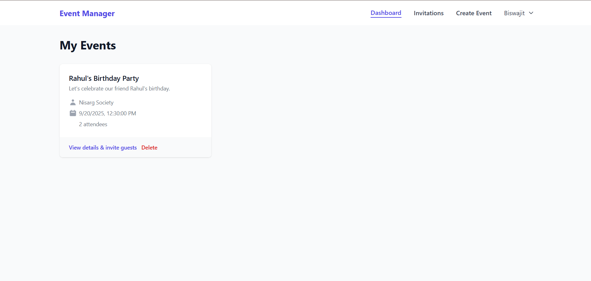

# Event Manager - Full-Stack MERN Event Management & RSVP System

A complete, full-stack event management system built with the MERN stack (MongoDB, Express.js, React, Node.js). This application allows users to create events, send email invitations, manage RSVPs, and check-in attendees using a unique QR code system. It follows the Model-View-Controller (MVC) architectural pattern for a clean and scalable codebase.

## ✨ Features

- **User Authentication & Authorization**: Secure user registration and login using JWT.
- **Event Management**: Users can Create, Read, Update, and Delete (CRUD) their events.
- **Email Invitations**: Automated sending of invitation emails via Nodemailer.
- **RSVP Management**: Guests can confirm or decline invitations via a unique link.
- **QR Code Integration**:
  - Unique QR code generated for each event for check-in.
  - QR code scanner for easy attendee check-in on mobile devices.
- **Interactive Dashboard**: View created events, events you're attending, and key metrics.
- **Email Reminders**: Automated reminders sent to confirmed attendees 24 hours before the event.
- **Fully Responsive UI**: Styled with Tailwind CSS for a modern look on all devices.

## 🛠️ Technology Stack

### Frontend
- **React 18** with functional components and hooks (useState, useEffect, useContext)
- **React Router** for navigation and routing
- **Tailwind CSS** for styling
- **QR Code Scanner Library** for QR code generation and scanning

### Backend
- **Node.js** - Runtime environment
- **Express.js** - Web framework
- **Mongoose** - MongoDB object modeling
- **JSON Web Token (JWT)** - For authentication
- **Bcryptjs** - For password hashing
- **Nodemailer** - For sending emails
- **QRCode** - For generating QR codes on the server
- **Cors** - To enable Cross-Origin Resource Sharing
- **Dotenv** - For managing environment variables

### Database
- **MongoDB** - NoSQL database

## 📁 Project Structure

```
event-rsvp-system/
├── backend/                 # Node.js/Express Backend
│   ├── node_modules/
│   ├── src/
│   │   ├── controllers/     # Route controllers (auth, event, invitation, checkin, qr code)
│   │   ├── middleware/      # Middlewares (auth, authorize, errorHandler)
│   │   ├── models/          # Mongoose models (User, Event, Invitation)
│   │   ├── routes/          # API Routes (auth, checkin, events, invitation, qr)
│   │   ├── utils/           # Utilities (emailService, generateToken, qrGenerator)
│   │   ├── views/           # Views (emailVerified.html)
│   │   └── server.js        # Express server entry point
│   ├── .env                 # Environment variables (gitignored)
│   ├── package.json
│   └── package-lock.json
├── frontend/                # React Frontend
│   ├── node_modules/
│   ├── public/              # favicon, index.html, logo
│   ├── src/
│   │   ├── components/      # Reusable UI components
│   │   ├── pages/           # Page components (Login, Dashboard, EventDetails, etc)
│   │   ├── context/         # React Context for state management (AuthContext)
│   │   ├── api/             # Axios configuration and API calls
│   │   ├── App.css
│   │   ├── reportWebVitals.js
│   │   └── App.js
│   ├── postcss.config.js
│   ├── tailwind.config.css
│   ├── package.json
│   └── package-lock.json
└── README.md
```

## ⚙️ Installation & Setup

Follow these steps to set up the project locally on your machine.

### Prerequisites
- Node.js (v16 or higher)
- npm or yarn
- A MongoDB database (local or cloud Atlas cluster)
- Gmail account (or another email service for Nodemailer)

### 1. Clone the Repository
```bash
git clone https://github.com/ajaymkoli/RVSP/tree/master
cd RVSP
```

### 2. Backend Setup
```bash
# Navigate to the backend directory
cd backend

# Install all dependencies
npm install

# Create a .env file in the /backend directory and configure your environment variables.
# See the "Environment Variables" section below for required keys.

# Start the development server
npm run dev
```
The backend server will run on `http://localhost:5000`.

### 3. Frontend Setup
```bash
# Open a new terminal and navigate to the frontend directory
cd ../frontend

# Install all dependencies
npm install

# Start the React development server
npm start
```
The frontend will run on `http://localhost:3000` and should automatically open in your browser.

## 🔧 Environment Variables

### Backend (.env)
Create a `.env` file in the `backend` directory with the following variables:

```ini
# Server Port
PORT=5000

# MongoDB Connection String
MONGODB_URI=your_mongodb_connection_string

# JWT Secret Key
JWT_SECRET=your_super_secret_jwt_key_here

# Email Service Configuration (for Nodemailer - using Gmail example)
EMAIL_HOST=smtp.gmail.com
EMAIL_PORT=587
EMAIL_USER=your.email@gmail.com
EMAIL_PASS=your_app_specific_password # NOT your regular Gmail password
```

*Note: For Gmail, you need to generate an "App Password" if 2-factor authentication is enabled.*

## 🧩 API Endpoints

| Method | Endpoint | Description | Access |
|--------|----------|-------------|--------|
| POST | `/api/auth/register` | Register a new user | Public |
| POST | `/api/auth/login` | Login a user | Public |
| GET | `/api/events` | Get all events for the logged-in user | Private |
| POST | `/api/events` | Create a new event | Private |
| GET | `/api/events/:id` | Get a specific event's details | Private |
| PUT | `/api/events/:id` | Update a specific event | Private (Event Creator only) |
| DELETE | `/api/events/:id` | Delete a specific event | Private (Event Creator only) |
| POST | `/api/events/:eventId/invite` | Send invitations for an event | Private (Event Creator only) |
| PUT | `/api/invitations/:invitationId/rsvp` | Submit an RSVP response | Public (via email link) |
| GET | `/api/dashboard/my-events` | Get dashboard data (created/attending events) | Private |
| POST | `/api/checkin/scan-qr` | Validate a QR code and check-in an attendee | Private (Event Creator only) |

## 🎯 Usage

1. **Register/Login**: Create a new account or log in to an existing one.
2. **Create an Event**: Fill out the event creation form with title, description, location, and date.
3. **Invite Guests**: From the event details page, enter guest emails to send invitations. They will receive an email with a link to the RSVP page.
4. **RSVP as a Guest**: Click the link in your email to confirm or decline the invitation.
5. **Check-in Attendees**: On the day of the event, use the QR scanner on the event details page to scan a guest's QR code (sent in their reminder email) to mark them as checked-in.
6. **View Dashboard**: See all your events and their stats on your personal dashboard.


## OUTPUT SCREENSHOTS
### Landing Page


### Registration Page


### Welcome Email


### Verification Email


### Login Page


### User Profile


### Dashboard


### Create Event


### Invitation Email


### Invitation confirmation form from email


### Attendee's Event view


### View at organizer post confirmation


### Checkin scanner


### Profile and logout options


## 🤝 Contributing

Contributions are welcome! Please follow these steps:

1. Fork the Project.
2. Create your Feature Branch (`git checkout -b feature/AmazingFeature`).
3. Commit your Changes (`git commit -m 'Add some AmazingFeature'`).
4. Push to the Branch (`git push origin feature/AmazingFeature`).
5. Open a Pull Request.

Please ensure your code follows the existing style and includes appropriate tests.

## 📄 License

This project is licensed under the MIT License - see the LICENSE file for details.

## 🙏 Acknowledgments

- Icons or assets used from bootstrap
- Thanks to the creators of the MERN stack and all the open-source libraries used.